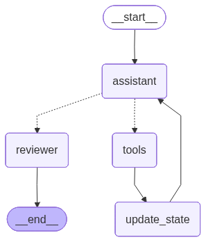

# Conversational AI Back-End Service with LangGraph

A healthcare back-end service leveraging a LangGraph multi-agent workflow to help patients manage appointments via a conversational interface. The primary assistant agent first authenticates the user before granting access to scheduling tools. Additionally, a dedicated review agent monitors the workflow to verify and correct the assistant's actions as needed and user actions as well.

## Features

- Conversational AI interface for healthcare appointments
- Patient identity verification
- Appointment listing, confirmation, and cancellation
- Persistent state tracking with PostgreSQL
- Multi-agent workflow using LangGraph
- Assistant agent and review agent working together



## Setup

### Prerequisites

- Python 3.10+
- Docker and Docker Compose
- PostgreSQL database

### Installation

1. Clone the repository:
   ```
   git clone https://github.com/yourusername/Conversational-AI-Back-End-Service-project.git
   cd Conversational-AI-Back-End-Service-project
   ```

2. Set up environment variables:
   ```
   cp .env.example .env
   ```
   Edit `.env` with your API keys and configuration.

3. Start with Docker:
   ```
   docker compose -f docker/docker-compose.yml up -d
   ```

4. Or install locally:
   ```
   pip install -r requirements.txt
   python init_db.py
   uvicorn app.main:app --reload
   ```

## Usage

The API has the following endpoints:

- `GET /`: Health check
- `POST /chat`: Send a message to the assistant
- `DELETE /chat/{session_id}`: Clear a conversation session
- `GET /sessions/{session_id}/states` : Get all states related to a session
- `GET /sessions/{session_id}/states/{state_id}` : Get specific state_id related to  a session


Example request:
```json
{
  "session_id": "user123",
  "message": "I'd like to check my appointments please"
}
```

## Testing

The project includes a comprehensive test suite using pytest. Tests are organised into three categories:

| Directory | Description | Requires DB? |
|---|---|---|
| `tests/agent/` | Agent behaviour — access control, appointment flows, robustness, safety | No ( will depend on `USE_MOCK_DATA` env variable if will use or not) |
| `tests/integration/` | State persistence, state tracking, patient data | Yes (PostgreSQL) |
| `tests/unit/` | Individual component unit tests | No ( will depend on `USE_MOCK_DATA` env variable if will use or not) |

### Running Tests with Docker

All Docker Compose files live inside the `docker/` directory.

| Compose file | Test suite | Needs DB? |
|---|---|---|
| `docker/docker-compose.agent-test.yml` | `tests/agent/` | No ( will depend on `USE_MOCK_DATA` env variable if will use or not) |
| `docker/docker-compose.unit-test.yml` | `tests/unit/` | No ( will depend on `USE_MOCK_DATA` env variable if will use or not) |
| `docker/docker-compose.integration-test.yml` | `tests/integration/` | Yes |
| `docker/docker-compose.test.yml` | All tests | Yes |

**Agent tests**:
```bash
docker compose -f docker/docker-compose.agent-test.yml up
PYTEST_ARGS="-xvs tests/agent/test_list_appointments.py" docker compose -f docker/docker-compose.agent-test.yml up
docker compose -f docker/docker-compose.agent-test.yml down
```

**Unit tests**:
```bash
docker compose -f docker/docker-compose.unit-test.yml up
docker compose -f docker/docker-compose.unit-test.yml down
```

**All tests** (spins up a dedicated PostgreSQL instance):
```bash
docker compose -f docker/docker-compose.test.yml up
```

Or use the provided helper script:
```bash
./run-tests.sh
```

Additional options:
```bash
# Run specific tests
./run-tests.sh "-xvs tests/integration/test_state_tracking.py"

# Skip rebuilding the container
./run-tests.sh --no-rebuild "-xvs tests/unit/"
```

### Running Tests Locally

```bash
# Run all tests
pytest

# Run only agent tests
pytest tests/agent/

# Run only unit tests
pytest tests/unit/

# Run only integration tests
pytest tests/integration/

# Run with coverage
pytest --cov=app

# Run a specific test file
pytest tests/agent/test_list_appointments.py
```

For more test options, see the documentation in `tests/README.md`.


## Architecture

The service follows a layered architecture:

- `app/main.py`: FastAPI application entry point
- `app/agent/graph.py`: LangGraph workflow definition
- `app/agent/tools.py`: LangChain tools for appointment management
- `app/agent/review_tools.py`: LangChain tools for the review agent
- `app/agent/state.py`: State definitions and transitions
- `app/agent/persistence.py`: PostgreSQL state persistence
- `app/data.py`: Data access layer
- `app/models.py`: Pydantic models for API

## Database Schema

The service uses PostgreSQL with the following schema:

- `sessions`: Conversation sessions
- `graph_states`: Persistent LangGraph states
- `state_transitions`: State transition history
- `patients`: Patient records
- `appointments`: Appointment records

## License

[MIT License](LICENSE)