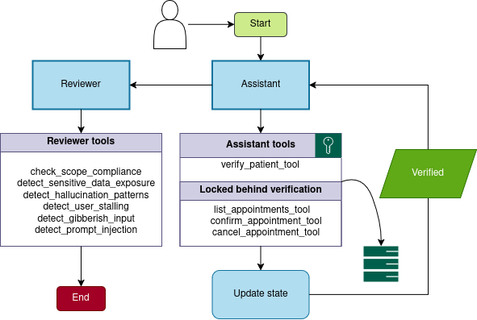

# Conversational AI Back-End Service with LangGraph

A healthcare back-end service leveraging a LangGraph multi-agent workflow to help patients manage appointments via a conversational interface. The primary assistant agent first authenticates the user before granting access to scheduling tools. Additionally, a dedicated review agent monitors the workflow to verify and correct the assistant's actions as needed and user actions as well.



## 🌟 Key Features

- **Conversational AI Interface** for healthcare appointments
- **Patient Identity Verification** – mandatory first step before any appointment action
- **Appointment Management** – listing, confirmation, and cancellation
- **Persistent State Tracking** with PostgreSQL for conversation history
- **Transition Tracking** to analyze how conversations flow between states
- **Multi-Agent Workflow** with a primary assistant and a quality-control reviewer agent
- **Secure Access Control** – tools locked behind verification
- **Comprehensive Audit Trail** – all interactions logged and reviewable
- **Memory Management & Context Handling** – expanding context approach for identity verification

## 🧠 Memory Management & Context Handling

The assistant employs an **expanding context approach** to manage conversation history, ensuring that recent interactions are prioritized during identity verification. This method enhances the accuracy and efficiency of the verification process by focusing on the most relevant information provided by the user in the latest messages.

### Expanding Context Approach
- **Dynamic Context Growth**: The system maintains a growing context of the conversation, with recent messages being more relevant for identity verification.
- **Prioritization of Recent Data**: During verification, the assistant focuses on the latest user inputs to collect full name, phone, and date of birth, ensuring up-to-date information.
- **Handling Failed Attempts**: If verification fails, the system does not reuse previous data but requests the latest details again, preventing reliance on outdated or incorrect information.
- **Integration with Reviewer Agent**: The expanding context is made available to the reviewer agent, which evaluates the assistant's responses against security and compliance criteria using its six specialized tools.

This approach ensures that the identity verification is based on the most current and accurate information provided by the user, improving both security and user experience.

## 📋 Table of Contents

1. [Architecture Overview](#architecture-overview)
2. [Database Integration](#database-integration)
3. [State Tracking](#state-tracking)
4. [Transition Tracking](#transition-tracking)
5. [Reviewer Agent](#reviewer-agent)
6. [Tools Access Control](#tools-access-control)
7. [Setup & Installation](#setup--installation)
8. [Usage](#usage)
9. [Testing](#testing)
10. [License](#license)

## 🏗️ Architecture Overview

The service follows a layered architecture:

- **FastAPI Application** (`app/main.py`) – RESTful API endpoints
- **LangGraph Workflow** (`app/agent/graph.py`) – orchestrates the multi-agent conversation
- **Assistant Agent** – handles user interaction and appointment actions
- **Reviewer Agent** – quality-control guardian that evaluates assistant responses
- **Persistence Layer** – PostgreSQL for state and transition storage
- **Data Access Layer** – `app/data.py` and `app/data_persistence.py` for mock and real data


## 🗄️ Database Integration

The system uses PostgreSQL with the following core tables:

| Table | Purpose |
|-------|---------|
| `sessions` | Stores conversation sessions |
| `graph_states` | Persists LangGraph state snapshots |
| `state_transitions` | Tracks transitions between states |
| `patients` | Patient records with identity verification data |
| `appointments` | Appointment records linked to patients |

### Schema Highlights

- **State Data**: Serialized JSON stored in `state_data` column
- **Transition Data**: Includes `transition_type` and `transition_data` for audit trails
- **Status Tracking**: Appointments use `AppointmentStatus` enum (scheduled, confirmed, cancelled, etc.)
- **Identity Verification**: Patient identity verified before any appointment tool can be called

## 📈 State Tracking

The system maintains a complete history of conversation states:

- Each state includes `state_id`, `session_id`, `state_data`, and `created_at`
- States are stored in the `graph_states` table with proper foreign key relationships
- State transitions are recorded in the `state_transitions` table, capturing:
  - Source and destination state IDs
  - Transition type (e.g., "user_message", "tool_execution")
  - Additional transition metadata  - Timestamped audit trail

This enables comprehensive conversation analysis and debugging.

## 🔍 Transition Tracking

All state transitions are systematically recorded:

- **Transition Types**: Include user messages, tool executions, verification results
- **Metadata Capture**: Includes tool call details, verification status, and context- **Auditability**: Full traceability from initial greeting to final appointment action
- **Visualization**: Transition data can be retrieved via `/sessions/{session_id}/transitions` endpoint

## 👁️ Reviewer AgentA dedicated quality-control guardian agent evaluates every assistant response:

### Review Tools (6)

1. **Scope Compliance** - Ensures responses stay within appointment scheduling scope
2. **Sensitive Data Exposure** - Detects leakage of internal IDs, API keys, or patient data
3. **Hallucination Detection** - Identifies fabricated appointment details or unverified claims
4. **User Stalling Detection** - Flags repetitive or avoidant user behavior
5. **Gibberish Detection** - Catches nonsensical or random input
6. **Prompt Injection Detection** - Prevents override of system instructions

### Verdict System

- **"pass"** - No issues detected- **"flag"** - Non-critical issues (stalling, gibberish)
- **"block"** - Critical issues (sensitive data exposure, severe hallucination)

When a "block" verdict is issued, the reviewer provides a safe replacement message to protect the user experience.

## 🔒 Tools Access Control

Critical appointment tools are **locked behind verification**:

- `verify_patient_tool` - Must succeed before any other appointment tool can be called
- `list_appointments_tool` - Only callable after verification
- `confirm_appointment_tool` - Only callable after verification
- `cancel_appointment_tool` - Only callable after verification

The system enforces this rule at the graph level, intercepting any unauthorized tool calls and returning clear error messages.

## ⚙️ Setup & Installation

### Prerequisites

- Python 3.10+
- Docker and Docker Compose
- PostgreSQL database

### Installation Steps

1. Clone the repository:
   ```bash
   git clone https://github.com/yourusername/Conversational-AI-Back-End-Service-project.git   cd Conversational-AI-Back-End-Service-project
   ```

2. Set up environment variables:
   ```bash
   cp .env.example .env   # Edit .env with your API keys and configuration
   ```

3. Start with Docker Compose:
   ```bash
   docker compose -f docker/docker-compose.yml up -d
   ```

4. Initialize the database:
   ```bash
   python init_db.py
   ```

5. Run the application:
   ```bash
   uvicorn app.main:app --reload   ```

## 🚀 Usage

The API provides the following endpoints:

- `GET /` - Health check
- `POST /chat` - Send a message to the assistant
- `DELETE /chat/{session_id}` - Clear a conversation session
- `GET /sessions/{session_id}/states` - Get all states for a session
- `GET /sessions/{session_id}/states/{state_id}` - Get a specific state
- `GET /sessions/{session_id}/transitions` - Get all transitions for a session

### Example Chat Request

```json
{
  "session_id": "user123",
  "message": "I'd like to check my upcoming appointments please"
}
```

## 🧪 Testing

The project includes a comprehensive test suite organized into three categories:

| Category | Description | Database Required? |
|----------|-------------|-------------------|
| `tests/agent/` | Agent behavior – access control, appointment flows, robustness, safety | No (uses `USE_MOCK_DATA`) |
| `tests/integration/` | State persistence, state tracking, patient data | Yes (PostgreSQL) |
| `tests/unit/` | Individual component unit tests | No (uses `USE_MOCK_DATA`) |

### Running Tests

All Docker Compose files live in the `docker/` directory:

- **Agent Tests**: `docker compose -f docker/docker-compose.agent-test.yml up`
- **Unit Tests**: `docker compose -f docker/docker-compose.unit-test.yml up`
- **Integration Tests**: `docker compose -f docker/docker-compose.integration-test.yml up`
- **All Tests**: `docker compose -f docker/docker-compose.test.yml up`

Or use the provided helper script:
```bash
./run-tests.sh
```

## 📚 Additional Documentation

- **Agent Workflow**: See `app/agent/graph.py` for the complete graph definition
- **State Persistence**: Detailed in `app/agent/persistence.py`
- **Review Process**: Explained in `app/agent/review_tools.py`
- **Database Schema**: Defined in `app/db.py`

## 📄 License[MIT License](LICENSE)